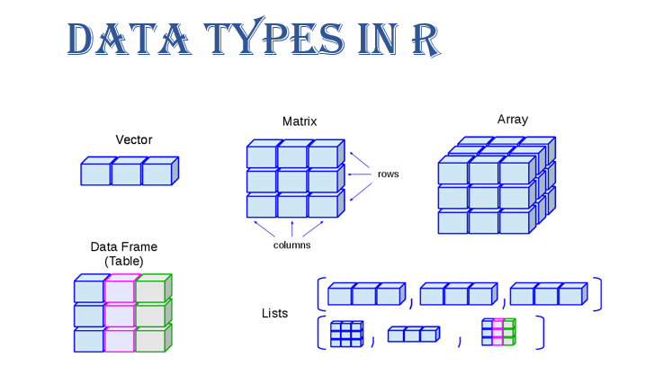
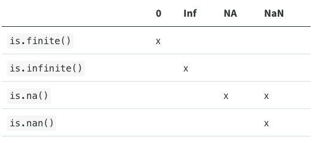
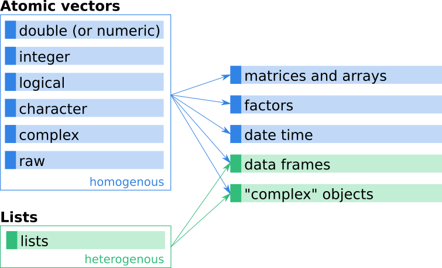
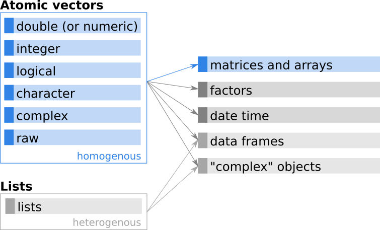
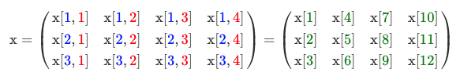

# Programming Fundamentals

## R variables and data types
A basic concept in (statistical) programming is called a **variable**.

A variable allows you to store a value (*e.g. 4*) or an object (*e.g. a function description*) in R. You can then later use this variable's name to easily access the value or the object that is stored within this variable.

You can assign a value `3` to a variable `myvariable` with the command:

```{r collapse = TRUE}
myvariable <- 3
myvariable
myvariable = 3
myvariable
3 -> myvariable
myvariable
myvariable^2
```


There are several different types of data you can use in R. We’ll examine a few common ones in a little more detail.

**Variable type** | **Type** | **Example**
------------|---------------|---------------------------------
integer | Whole numbers | 1, 100, -9
numeric (or double) | Floats | 0.1, -0.09, 234.567
character | Text | "A", "hello", "welcome"
logical | Booleans | TRUE or FALSE
complex | Real+imaginary numbers | -5+11i, 3+2i, 0+4i
factor | Categorical | "green", "blue", "red", "purple"
missing | Logical | NA
empty | - | NULL
raw | Raw bytes (as hexadecimal) | 01, ff

**Data type** | **Type**
---------------|------------------------------------------------
vector | 1D collection of variables of the same type
matrix | 2D collection of variables of the same type
dataframe | 2D collection of variables of multiple types


There are several different types of data you can use in R. We'll examine a few common ones in a little more detail.

### Text
Strings are known as "character" in R. Use the double quotes `"` or single quotes `'` to wrap around the string
```{r}
myname <- "nick"
```

We can use the `class()` function to see what data type it is
```{r}
class(myname)
```

### Numbers
Numbers have different classes. The most common two are `integer` and `numeric`. Integers are whole numbers:
```{r collapse = TRUE}
favourite.integer <- as.integer(8)
print(favourite.integer)
class(favourite.integer)
```

Numbers can be `numeric` which are decimals:
```{r collapse = TRUE}
favourite.numeric <- as.numeric(8.8)
print(favourite.numeric)
class(favourite.numeric)
```

Integer and double vectors are known collectively as numeric vectors. In R, numbers are doubles by default. To make an integer, place an `L` after the number:

```{r collapse = TRUE}
typeof(1)
typeof(1L)
```

The distinction between integers and doubles is not usually important, but there are two important differences that you should be aware of:

1. Doubles are approximations. Doubles represent floating point numbers that can not always be precisely represented with a fixed amount of memory. This means that you should consider all doubles to be approximations. For example, what is square of the square root of two?

```{r collapse = TRUE}
x <- sqrt(2) ^ 2
x 
x - 2
```

This behaviour is common when working with floating point numbers: most calculations include some approximation error. Instead of comparing floating point numbers using `==`, you should use `dplyr::near()` which allows for some numerical tolerance.

2. Integers have one special value: `NA`, while doubles have four: `NA`, `NaN`, `Inf` and `-Inf`. All three special values `NaN`, `Inf` and `-Inf` can arise during division:

```{r}
c(-1, 0, 1) / 0
```

Avoid using` ==` to check for these other special values. Instead use the helper functions `is.finite()`, `is.infinite()`, and `is.nan()`:



### Logical (True/False)
We use the `==` to test for equality in R
```{r collapse = TRUE}
class(TRUE)
favourite.numeric == 8.8
favourite.numeric == 9.9
```


### Vectors
We can create 1D data structures called "vectors".
```{r collapse = TRUE}
1:10
2*(1:10)
seq(0, 10, 2)
```


We can store vectors and perform operations on them.
```{r collapse = TRUE}
myvector <- 1:10
myvector
2^myvector
b <- c(3,4,5)
b^2
disorders <- c("autism","ocd", "depression", "ocd", "anxiety", "autism")
disorders
```

An alternative way to create a vector of a specific type and length is the function `vector()`. `vector()` requires two input arguments, namely the type of the vector (or ‘mode’) and the length of the vector.

```{r}
# Double (numeric) vector of length 5
vector("double", length = 5)
```

There are two types of vectors:

* Atomic vectors, of which there are six types: logical, integer, double, character, complex, and raw. Integer and double vectors are collectively known as numeric vectors. All elements must have the same basic type (e.g., numeric, character, …).

* Lists, which are sometimes called recursive vectors because lists can contain other lists. Special vector mode. Different elements can have different types.

The image below shows a (simplified) schematic overview of how various more complex objects (on the right hand side) are based on vectors (on the left hand side).



We follow standard albeit somewhat sloppy jargon and refer to atomic vectors simply as vectors while referring to vectors of mode list explicitly as lists (rather than vectors).

#### Automatic type conversions

We’ve seen that atomic vectors can be of type character, numeric (or double), integer, and logical. But what happens if we try to mix these types in a single vector? This can result in unexpected problems because R implicitly converts them to all be the same type...

```{r collapse = TRUE}
mybool <- c(rep(TRUE, 5), rep(FALSE, 5))
class(mybool)
mybool <- c(mybool, 10)
class(mybool)
mybool <- c(mybool, "10")
class(mybool)
```

How many values in `combined_logical` are `"TRUE"` (as a character) in the following example:

```{r collapse = TRUE}
num_logical <- c(1, 2, 3, TRUE)
char_logical <- c("a", "b", "c", TRUE)
combined_logical <- c(num_logical, char_logical)
```

Only one. There is no memory of past data types, and the coercion happens the first time the vector is evaluated. Therefore, the TRUE in `num_logical` gets converted into a `1` before it gets converted into `"1"` in `combined_logical`.

In R, we call converting objects from one class into another class *coercion*. These conversions happen according to a hierarchy, whereby some types get preferentially coerced into other types.

#### Important vector functions 

A few of the most important ones for creating and investigating simple vectors are:

* `c()`: Combines multiple elements into one atomic vector.
* `length()`: Returns the length (number of elements) of an object.
* `class()`: Returns the class of an object.
* `typeof()`: Returns the type of an object. There is a small (sometimes important) difference between `typeof()` and `class()` as we will see later.
* `attributes()`: Returns further metadata of arbitrary type.
* `str()`: Compactly displaying the internal structure of a R object (str from Structure).

```{r}
gfg <- list(2, 4, 5, 6, 7, 9, 13, 15, 3, 1)
  
# Calling str() function
str(gfg)
```


```{r collapse = TRUE}
x <- 1.5
length(x)  # Length of the vector.
class(x)  # What is the class of the object?
typeof(x)   # What is the type of this vector?
```


While the class is “numeric” the underlying type is “double”. As shown, `class()` and `typeof()` can be used to determine the class and type of an object. Both functions return a character vector which contains the name of the class/type (e.g., "numeric" or "integer").

Alternatively, a range of functions exist to check whether or not an object is of a specific type. These very handy functions return either a logical `TRUE` if the input is of this specific type, or `FALSE` if not. Examples are:

`is.double()`
`is.numeric()`
`is.integer()`
`is.logical()`
`is.character()`
`is.vector()`
… and many more.

```{r}
is.integer(1.5)
```

> *Note:* Avoid `is.vector()`, `is.atomic()`, and `is.numeric()`: they don’t test if you have a vector, atomic vector, or numeric vector; you’ll need to carefully read the documentation to figure out what they actually do.


Let us check what `class()` and `typeof()` returns for `1`, `1.0`, and `1L`:

**x** | **class(x)** | **typeof(x)** | **is.double(x)** |	**is.integer(x)** |	**is.numeric(x)**
------------|------------|------------|------------|------------|------------|
`1`	| numeric	| double | **TRUE**	| FALSE	| **TRUE**
`1.0`	| numeric |	double | **TRUE**	| FALSE	| **TRUE**
`1L`	| integer	| integer	| FALSE |	**TRUE** | **TRUE**


#### Naming a vector

You can give a name to the elements of a vector with the `names()` function. Have a look at this example:

```{r collapse = TRUE}
# Roulette winnings from Monday to Friday
roulette_vector <- c(-24, -50, 100, -350, 10)

# Assign days as names of roulette_vector
names(roulette_vector) <- c("Monday", "Tuesday", "Wednesday", "Thursday", "Friday")

attributes(roulette_vector)
str(roulette_vector)
```

However, when you look at it from a higher perspective, there is a more efficient way to do this, namely, to assign the days of the week vector to a variable!

```{r collapse = TRUE}
# The variable days_vector
days_vector <- c("Monday", "Tuesday", "Wednesday", "Thursday", "Friday")
 
# Assign the names of the day to roulette_vector 
names(roulette_vector) <- days_vector
```

Or we can do it like this:

```{r collapse = TRUE}
# create a new object called shoebox
shoebox <- c(brand = "Nike", size = 10, model = "Pegasus")
# look at the object called shoebox
shoebox
```

> *Note*: Or you could use `purrr::set_names()`

When elements are named, we can extract by name instead of by index.

```{r collapse = TRUE}
# extract the brand
shoebox['brand']
# this is the same as:
shoebox[1]
# extract the size and model
shoebox[c('size','model')]
# change the size to 11
shoebox['size'] <- 11
# view the object called shoebox
shoebox
```

You can remove names from a vector by using `x <- unname(x)` or `names(x) <- NULL`.

#### Subsetting vectors

Vectors can be subsetted in different ways:

* By index (position in the vector).
* Based on logical vectors.
* By name (if set).

##### Indexing and slicing

```{r collapse = TRUE}
# create a new object called fiveRandoms, using the runif function (“random uniform”)
fiveRandoms <- runif(n = 5)

# create a new object called fiveIntegers, using the sample function
fiveIntegers  <- sample(x = c(1:100), size = 5, replace = TRUE)

# use the c function to combine the two vectors, fiveIntegers and fiveRandoms into a new object called my.vector
my.vector <- c(fiveIntegers,fiveRandoms)

# look at the object 
my.vector
```

Each of the 10 numbers (or elements) in my.vector has a position within the vector, and R has a specific syntax for pulling certain elements out of the vector object. Here are 7 examples:

1. To get the first element stored in `my.vector`, use `my.vector[1]`
2. To get the third element stored in `my.vector`, use `my.vector[3]`
3. To get the first three elements stored in `my.vector`, use `my.vector[1:3]`
4. To get elements 3, 5, 7, and 8, use `my.vector[c(3,5,7,8)]`
5. To return everything but elements 1, 3, 7, and 8, use `my.vector[-c(1,3,7,8)]`
6. To get all of the elements, except the fifth element, use `my.vector[-5]`
7. To get the last three elements only, use `my.vector[-(1:7)]`

Of these, example 4 is “tricky” because `my.vector[c(3,5,7,8)]` embeds a c function so that we can pull out various combinations of numbers, in the specified order. You’ll find this to be a very, very useful approach. You can’t just type in `my.vector[3,5,7,8]` because R will think you are trying to extract an element from a four dimensional array!

If we want to exclude certain indices, we use a - symbol, as shown in examples 5, 6, and 7. Example 6 is pretty straightforward: `my.vector[-5]` means return all elements of my.vector except the fifth element. But example 7 is tricky. The `my.vector[-(1:7)]` example uses parentheses to surround the numbers 1 through 7. If we didn’t have the parentheses, we would get an error. Try this:

```{r eval=FALSE}
my.vector[-1:7]
```

```{r eval=FALSE}
Error in my.vector[-1:7] : only 0's may be mixed with negative subscripts
```

What the error says is an important troubleshooting message! There error says “only 0’s may be mixed with negative subscripts”. A negative subscript indicates exclusion, but -1 is mixed with 7. You can’t omit some indices and select others at the same time. By entering `my.vector[-(1:7)]`, we are telling R to exclude indices 1 through 7.

##### Subsetting by name

If we have named vectors we can make use of the names of the elements to access them. Let us use the following named vector:

```{r collapse = TRUE}
x <- c(age = 35, height = 1.72, zipcode = 6020)
x["age"]
```

As for subsetting by indexes, we can also ask for multiple elements at the same time. However, *negative subsetting* (`x[-"age"]`) does not work.

```{r}
x[c("age", "zipcode")]  # get both, "age" and "zipcode"
```

##### Subsetting by logical vectors

```{r collapse = TRUE}
x <- c(30, 10, 20, 0, 30, 50)
x[c(TRUE, TRUE, FALSE, FALSE, FALSE, FALSE)]
```

Some more examples which you can try yourself given our vector `x <- c(30, 10, 20, 0, 30, 50)`:

* `x[x == 30]`: Elements in `x` where `x` is (exactly) equal to 30
* `x[x == 30 | x == 50]`: Elements where `x` is either equal to 30 OR equal to 50.
* `x[x == 30 & x == 50]`: Elements where `x` is equal to 30 AND 50 at the same time. The result should be an empty vector as this is not possible.
* `x[x >= 30 & x < 40]`: All elements where `x` is larger than or equal to 30, but less than 40.
* `x[x < 30 & x > 40]`: All elements where `x` is less than 30 AND larger than 40 at the same time. Again, impossible, the result should be an empty vector.

Such expressions can also be more complex and/or use data over different vectors. We can also store the logical vector onto a new object and use this object for subsetting. As an example, imagine we have two numeric vectors age and height with the `age` and `height` of some people.

```{r collapse = TRUE}
age    <- c(  25,   53,   21,   50,   18,   63)
height <- c(1.73, 1.69, 1.83, 1.57, 1.91, 1.75)
```

We would like to get the age of those smaller than `1.8`. In this case we first perform the relational comparison on the vector `height`. The result (a logical vector) is stored onto a new object `res`. In a second step we then use `res` to subset the `age` vector.


```{r collapse = TRUE}
res <- height < 1.8
res
age[res]

# We can, of course, do this in one line:
age[height < 1.8]
```

Or extend the expression to get the age for those who are smaller than `1.8` and older than `50` years.

```{r}
age[age > 50 & height < 1.8]
```

**Warning**: Avoid using == for floating point arithmetic on double vectors. This can lead to unexpected results due to small imprecisions. An example:

```{r collapse = TRUE}
(1.5 - 0.5) == 1
(1.9 - 0.9) == 1
```

**Alternative**: Better use the function `all.equal()`. The function checks if numeric values are equal (but not exactly equal) by allowing for a (very small) tolerance. For those interested what the tolerance is, check `?all.equal`.

```{r}
all.equal(1.9 - 0.9, 1)
```

Besides the relational and logical operators shown above, some more exist.

* `&&`, `||`: Like `&` (and) and `|` (or) but evaluate only first elements until results are determined.
* `isTRUE()`, `isFALSE()`: Test for single non-missing `TRUE` or `FALSE`.

There is a distinct difference between `&`/`|` and the longer form `&&`/`||`. While `&` and `|` can be used on vectors (element-wise logical comparison), the longer form evaluates left to right examining *only the first element of each vector*. The evaluation proceeds only until the result is determined. While the long form can be very handy in some situations (e.g., conditional execution) we will mainly use the short form (`&`/`|`).

**Index of `TRUE` elements**

Often one is interested in where elements are stored which match an expression. Therefore we can use the function `which()`. `which()` returns the indices of the elements where the expression evaluated to `TRUE`.


```{r collapse = TRUE}
x <- c(30, 10, 20, 0, 30, 50)
x >= 30
which(x >= 30)
```

The expression `x >= 30` is `TRUE` for the elements at position or index 1, 5, 6, which is exactly what `which()` returns.

**Example**: Find the position of the minimum and the maximum of the vector `x`:


```{r collapse = TRUE}
min(x)                # The minimum
x == min(x)           # Comparison
which(x == min(x))    # Index/position
```

In addition, there are two functions `which.min()` and `which.max()` which are more reliable to find the minimum/maximum of floating point numbers. However, they only return the index of the very first occurrence of the minimum/maximum! Imagine the following vector `z`. The minimum is `0.5` which occurs twice, position 2 and 5. Now compare the different result of `which(z == min(z))` and `which.min(z)`:

```{r collapse = TRUE}
z <- c(10, 0.5, 20, 30, 0.5)
which(z == min(z))     # Position/index of all minima
which.min(z)           # Position/index of first occurrence of minimum
```

The same is valid for `which.max()`.

**Single and double brackets**

We can use single brackets (`[]`) or double brackets (`[[]]`) for subsetting. While we will most often use single brackets, let us see what they do different.

`[]` keeps the name attribute, while `[[]]` drops them all. If we have an unnamed vector there is no difference between the two:

```{r collapse = TRUE}
(x <- c(54, 1.82, 6020))
x[3]       # Single brackets
x[[3]]     # Double brackets
```

However, if we have a named vector the result of the two commands look different:

```{r collapse = TRUE}
(x <- c("age" = 54, "height" = 1.82, "zipcode" = 6020))
x[3]
x[[3]]
```

The same is true for subsetting by name or logical vectors.


#### Mathematical operations

Once we have a vector (even vectors of length `1`; single value) we can perform arithmetic operations on them. A list of available arithmetic operators can be found on the help page `?Arithmetic`. The following ones are available:

**operator** | **description** | **example**
------------|------------|------------|
+	| addition	|	5 + 5 = 10
-	|	subtraction	|	5 - 5 = 0
*	|	multiplication	|	2 * 8 = 16
/	|	division	|	100 / 10 = 10
^ (or **)	|	exponent/power	|	5^2 = 25
%%	|	modulo	|	100 %% 15 = 10
%/%	|	integer division	|	100 %/% 15 = 6

Beside mathematical operators (see table above) a series of relational and logical operators exist. The table above shows the most important operators (see also `?Comparison`, `?Logic` and `?match`).

**Type** | **Operator** | **Condition**
------------|------------|------------|
Relational	|	`x < y`	|	Where `x` less than `y`
.	          | `x > y`	|	Where `x` greater than `y`
.	| `x <= y`	| Where `x` less than or equal to `y`
.	| `x >= y`	|	Where `x` greater than or equal to `y`
.	| `x == y`	|	Where `x` (exactly) equals `y`
.	| `x != x`	|	Where `x` is not equal to `y`
Logical	|	`!`	| Negation (NOT; `!x == 20`, same as `x != 20`)
.	| `&`		| Logical “and” (`x >= 20 & x < 35`)
.	| `|`	| Logical “or” (`x == 20 | x > 45`)
.	| `xor`	|	Logical “exclusive or” (`xor(x == 20, x == 50)`)
Value matching	|	`x %in% y` |	Where `x` is in `y` (value matching; character)
.	| `! x %in% y`	|	Where `x` is not in `y` (value matching; character)


**The `%in%` operator**

This funny looking operator is very handy. It’s short for testing if several values appear in an object. For instance:

```{r collapse = TRUE}
x = c(2, 6, 4, 4, 6, 8, 10, 14, 2)
# To grab all the values where x is 2, 4 or 14 we could do
x[x == 2 | x == 4 | x == 14]
# or we could use %in% …
x[x %in% c(2, 4, 14)]
```

**The `xor()` function**

The `xor()` function is an exclusive version of the `|`. Take two vector, `x` and `y`:

```{r collapse = TRUE}
x = c(1, 1, 2)
y = c(1, 2, 2)

# To get all the elements where either x is 1 or y is 2 we would write
x == 1 | y == 2

# However, this will also return the elements where x = 1 AND y = 2. If we only want elements where only one statement is TRUE, we would use xor()
xor(x == 1 , y == 2)

```

#### Missing values

One additional important element is the missing values. R knows two types of missing values: `NaN` and `NA`. `NaN` is “not a number” and results from mathematical operations which are illegal/invalid. NA on the other hand stands for ‘not available’ and indicates a missing value. `NA`s can occur in all the vectors discussed above, and keep their class.

* `NaN`: Mathematically not defined (and always of class numeric).
* `NA`: Missing value, `NA`’s still have classes!
* `NaN` is also `NA` but not vice versa.

Missing values tend to be infectious: most computations involving a missing value will return another missing value.

```{r collapse = TRUE}
NA > 5
10 * NA
!NA
```

There are only a few exceptions to this rule. These occur when some identity holds for all possible inputs:

```{r collapse = TRUE}
NA ^ 0
NA | TRUE
NA & FALSE
```

Propagation of missingness leads to a common mistake when determining which values in a vector are missing:
```{r collapse = TRUE, eval = FALSE}
x <- c(NA, 5, NA, 10)
x == NA
#> [1] NA NA NA NA
```

This result is correct (if a little surprising) because there’s no reason to believe that one missing value has the same value as another. Instead, use is.na() to test for the presence of missingness:

```{r eval = FALSE}
is.na(x)
#> [1]  TRUE FALSE  TRUE FALSE
```

> *Note:* Technically there are four missing values, one for each of the atomic types: *NA* (logical), *NA_integer_* (integer), *NA_real_* (double), and *NA_character_* (character). This distinction is usually unimportant because NA will be automatically coerced to the correct type when needed.

**Example for `NaN`**: Zero devided by zero (`0 / 0`) is not a valid mathematical operation, wherefore the result of the devision is `NaN`.

> *Note*: Missing values in R still have a class. We can have missing numeric, integer, logical, or character missing values. They all look the same, but have a class attached to it. When defining a new object and storing a single missing value on it (with `x <- NA`), it will be ‘logical’ by default. We can, however, convert them (if needed).

If R is not able to convert elements, it will return NA (and throw a warning):

```{r eval = FALSE}
# let `x` be a character vector
(x <- c("a", "b", "c", "d"))
```


```{r eval = FALSE}
## [1] "a" "b" "c" "d"
```


```{r eval = FALSE}
# Coerce to integer
as.integer(x)
```
```{r eval = FALSE}
## Warning: NAs introduced by coercion
## [1] NA NA NA NA
```

The following table contains a summary of what will happen if you convert the element `x` into one of the four classes “numeric”, “integer”, “logical”, or “character”:

**x** | **as.numeric** | **as.integer** | **as.logical** |	**as.character** 
------------|------------|------------|------------|------------|
2.9	| 2.9	| **2L** | **TRUE**	| **“2.9”**
0	| 0	| **0L** | **FALSE**	| **“0”**
4L	| **4**	| 4L | **TRUE**	| **“4”**
0L	| **0**	| 0L | **FALSE**	| **“0”**
TRUE	| **1**	| **1L** | TRUE	| **“TRUE”**
FALSE	| **0**	| **0L** | FALSE	| **“FALSE”**
“A”	| **NA** | **NA** | **NA**	| “A”
“TRUE”	| **NA** | **NA** | **TRUE**	| “TRUE”
“FALSE”	| **NA** | **NA** | **FALSE**	| “FALSE”
NA	| NA	| NA | NA	| **“NA”**

#### Appending Data to a Vector

If you want to append additional data items to a vector, use the vector constructor (`c`) to construct a vector with the additional data items:

```{r collapse = TRUE}
v <- c(1, 2, 3)
newItems <- c(6, 7, 8)
c(v, newItems)
```

For a single item, you can also assign the new item to the next vector element. R will automatically extend the vector:

```{r collapse = TRUE}
v <- c(1, 2, 3)
v[length(v) + 1] <- 42
v
```

If you ask us about appending a data item to a vector, we will likely suggest that maybe you shouldn’t.

> **Warning**:
R works best when you think about entire vectors, not single data items. Are you repeatedly appending items to a vector? If so, then you are probably working inside a loop. That’s OK for small vectors, but for large vectors your program will run slowly. The memory management in R works poorly when you repeatedly extend a vector by one element. Try to replace that loop with vector-level operations. You’ll write less code, and R will run much faster.

Another way:

Despite its name, the `append` function inserts data into a vector by using the `after` parameter, which gives the insertion point for the new item or items:

`append(vec,newvalues, after =n)`

The new items will be inserted at the position given by `after`. This example inserts 99 into the middle of a sequence:

```{r}
append(1:10, 99, after = 5)
```


The special value of `after=0` means insert the new items at the *head* of the vector:

```{r}
append(1:10, 99, after = 0)
```

#### Dimensions

Adding a dim attribute to a vector allows it to behave like a 2-dimensional matrix or a multi-dimensional array. Matrices and arrays are primarily mathematical and statistical tools, not programming tools, so they’ll be used infrequently and only covered briefly. 

You can create matrices and arrays with `matrix()` and `array()`, or by using the assignment form of `dim()`:

```{r eval = FALSE}
# Two scalar arguments specify row and column sizes
x <- matrix(1:6, nrow = 2, ncol = 3)
x
#>      [,1] [,2] [,3]
#> [1,]    1    3    5
#> [2,]    2    4    6

# One vector argument to describe all dimensions
y <- array(1:12, c(2, 3, 2))
y
#> , , 1
#> 
#>      [,1] [,2] [,3]
#> [1,]    1    3    5
#> [2,]    2    4    6
#> 
#> , , 2
#> 
#>      [,1] [,2] [,3]
#> [1,]    7    9   11
#> [2,]    8   10   12

# You can also modify an object in place by setting dim()
z <- 1:6
dim(z) <- c(3, 2)
z
#>      [,1] [,2]
#> [1,]    1    4
#> [2,]    2    5
#> [3,]    3    6
```

Many of the functions for working with vectors have generalisations for matrices and arrays:


**Vector** | **Matrix** | **Array** 
------------|------------|------------|
`names()`	| `rownames()`, `colnames()`	| `dimnames() `
`length()`	| `nrow()`, `ncol()`	| `dim()`
`c()`	| `rbind()`, `cbind()`	| `abind::abind() `
—	| `t()`	| `aperm() `
`is.null(dim(x))`	| `is.matrix()`	| `is.array()`

A vector without a dim attribute set is often thought of as 1-dimensional, but actually has NULL dimensions. You also can have matrices with a single row or single column, or arrays with a single dimension. They may print similarly, but will behave differently. The differences aren’t too important, but it’s useful to know they exist in case you get strange output from a function (`tapply()` is a frequent offender). As always, use `str()` to reveal the differences.

```{r eval = FALSE}
str(1:3)                   # 1d vector
#>  int [1:3] 1 2 3
str(matrix(1:3, ncol = 1)) # column vector
#>  int [1:3, 1] 1 2 3
str(matrix(1:3, nrow = 1)) # row vector
#>  int [1, 1:3] 1 2 3
str(array(1:3, 3))         # "array" vector
#>  int [1:3(1d)] 1 2 3
```

### Matrices

In the Vectors chapter we have learned about the atomic vectors and that they build the base for more complex objects. The next level of complexity are arrays and matrices. An array is a multi-dimensional extension of a vector. In the special case that the array has only two dimensions, this array is also called a matrix.

In R, a matrix is a collection of elements of the same data type (numeric, character, or logical) arranged into a fixed number of rows and columns. Since you are only working with rows and columns, a matrix is called two-dimensional.




You can construct a matrix in R with the `matrix()` function. Consider the following example:

```{r}
matrix(1:9, byrow = TRUE, nrow = 3)
```

The information in square brackets (`[1,]` or `[,3]`) is not part of the matrix itself, but helps you to read the output. On the left side you can see the indicator/number of the rows (`[1,]` = first row, `[2,]` = second row, `[3,]` = third row), while on top you can see the same for the columns (`[,1]` = first column, … `[,4]` = fourth column). We will come back to this later on when subsetting matrices.

In the `matrix()` function:

* The first argument is the collection of elements that R will arrange into the rows and columns of the matrix. Here, we use `1:9` which is a shortcut for `c(1, 2, 3, 4, 5, 6, 7, 8, 9)`.
* The argument `byrow` indicates that the matrix is filled by the rows. If we want the matrix to be filled by the columns, we just place `byrow = FALSE`.
* The third argument `nrow` indicates that the matrix should have three rows.

While a vector is a (long) sequence of values, a matrix is a two-dimensional rectangular object with values. Important aspects of matrices in R:

* Arrays are **based on atomic vectors**.
* A matrix is a special array with **two dimensions**.
* Matrices can only contain data of **one type** (like vectors).
* Matrices always also have a **length** (number of elements).
* In addition to vectors, matrices have an additional **dimension** attribute (`dim()`) which vectors don’t have.
* As vectors, matrices **can have names** (row and column names; optional attribute).

> *Note*: As all matrices (and arrays) are based on vectors, we can use explicit coercion to convert them back and forth. Let us take our matrix x and explicit coercion to convert it into a vector (as.vector())

#### Performing Matrix Operations

You can do basic arithmetic operations like `+`, `/` etc. with matrices. Besides simple arithmetic, R comes with a wide range of functions for mathematical tasks and can do ‘all’ you need. 

**Command** |	**Description**
------------|------------|
`t(x)` | Transpose x.
`diag(x)`, `diag(3L)`	| Diagonal elements of x.
`x %*% y`	| Matrix multiplication (inner product).
`solve(x)`	| Inverse of x.
`solve(a, b)`	| Solve system of linear equations.
`crossprod(x, y)`	| Cross product.
`outer(x, y)`, `x %o% y`	| Outer product.
`kronecker(x, y)`	| Kronecker product.
`det(x)`	| Determinant.
`qr(x)`	| QR decomposition
`chol(x)`	| Cholesky decomposition
`...`	| … and many more

For those interested in linear algebra/advanced mathematical topics using R, you may be want to check the following sources:

* See `?matmult` or `help("matmult")` for more details
* https://www.math.uh.edu/~jmorgan/Math6397/day13/LinearAlgebraR-Handout.pdf
* https://www.amazon.com/Hands-On-Matrix-Algebra-Using-Applications/dp/9814313696

#### Subsetting Matrices

As with vectors, we can use the following for subsetting matrices:

* Subsetting **by index**.
* Subsetting **by name** (if set).
* Subsetting **by logical vectors**.
* For matrices, subsetting is typically done two-dimensional (but not necessarily!).

In the previous chapter we have learned how to access the first element of a vector by calling `x[1]`. When working with matrices, we can access elements in a specific row and column in a similar way, except that we now have to specify the rows and the columns.

The first index is always the row index, the second one the column index. R helps us with that by adding the indicators when we print a matrix, `[1,]` is the indicator for the first row, `[,1]` on top the indicator for the first column.



> *Note*: The element `x[3]` (single index) is nothing else than the element `x[3, 1]` (row and column index). Or, as a second example, `x[2, 4]` is the same as `x[11]`.


